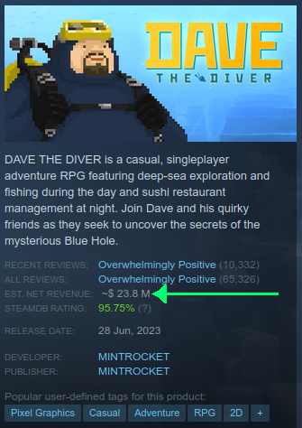

A Firefox extension that shows the estimated revenue for a game.

Copied from [this](https://clients2.google.com/service/update2/crx?response=redirect&prodversion=95.0.4638.54&acceptformat=crx2,crx3&x=id%3Dgjhejidajnchnadcangcodljgdmenipa%26uc) [Chrome extension](https://chromewebstore.google.com/detail/gjhejidajnchnadcangcodljgdmenipa) with permission of the original author (omer1615).

[Announcement blog post here](https://juanuys.com/blog/2023/11/24/steam-revenue-calculator-firefox-extension.html).

# Example

(Screenshot taken on 2023-11-23)

# Feedback

Please let me know if anything is broken or if you have any suggestions. The Boxleiter formula does change from time to time.

# The math

Some resources:

- 2022-11-14 https://newsletter.gamediscover.co/p/steam-sales-estimates-why-game-popularity
- 2021-08-01 https://vginsights.com/insights/article/how-to-estimate-steam-video-game-sales
- 2020-08-03 https://newsletter.gamediscover.co/p/how-that-game-sold-on-steam-using
- 2018-05-04 https://www.gamedeveloper.com/business/using-steam-reviews-to-estimate-sales
- 2015-03-12 https://greyaliengames.com/blog/how-to-estimate-how-many-sales-a-steam-game-has-made/
- ????-??-?? https://steam-revenue-calculator.com/

The extension just does a one-off calculation the moment you visit the store page, and it's not very accurate for older games.

The reason is that heuristics and multipliers are different the further back you go (see the VGInsights article above, and GameDiscoverCo's 2020 article), which this extension doesn't track.

Even if the extension took the year of release, then applied different multipliers based on the year, it would still be inaccurate because the extension doesn't have (or track) a breakdown of reviews per year, which is key in estimating sales, and hence revenue.

